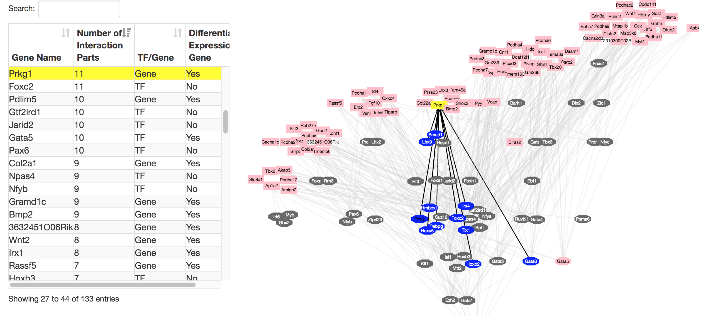

## Network Visualization Cases
- This repo shows two interaction networks consisting of transcription factors and genes, which is powered by [DataTables](https://datatables.net/) and [Cytoscape.js](http://js.cytoscape.org/). The network data are made by [Cytoscape](http://www.cytoscape.org/). 

### Usage
- Use `npm install` to install dependencies
- Use `npm run start` to start
- Check the result with URL: `http://localhost:3000/`

